# task_managment

# login Screen

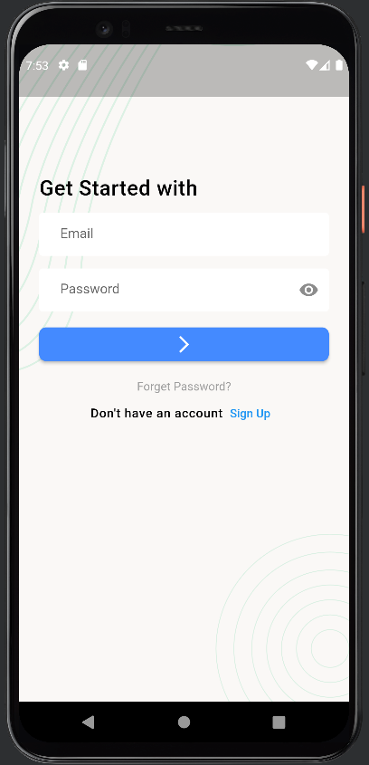

# validation

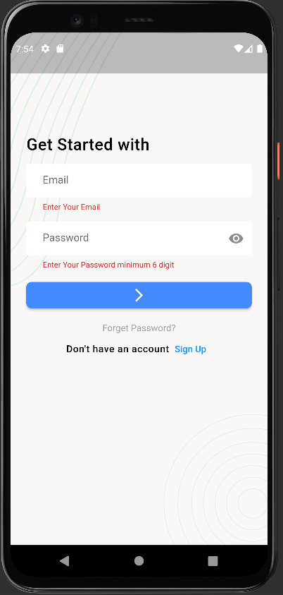

# on wrong login

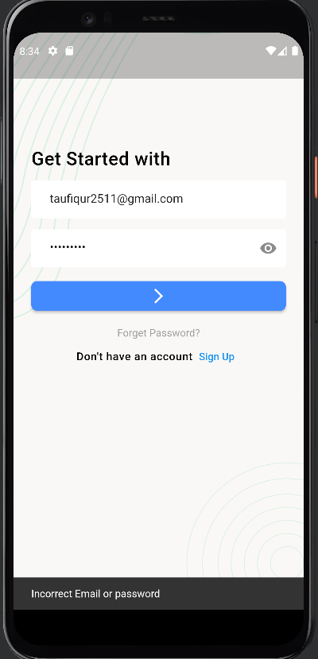

# sign up screen

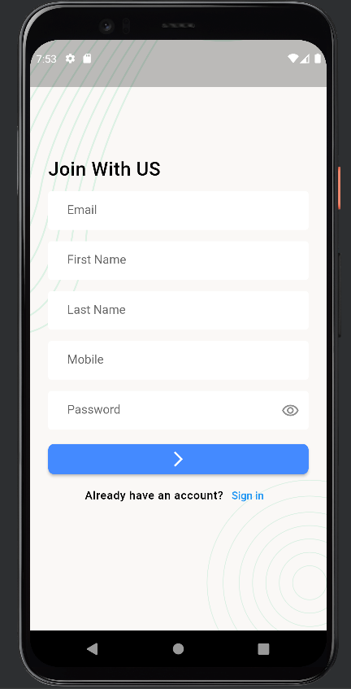

validation

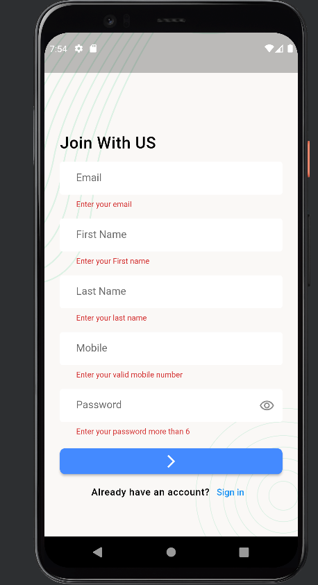

# forget password

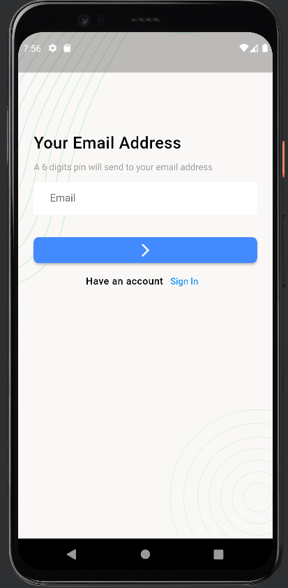

# validation

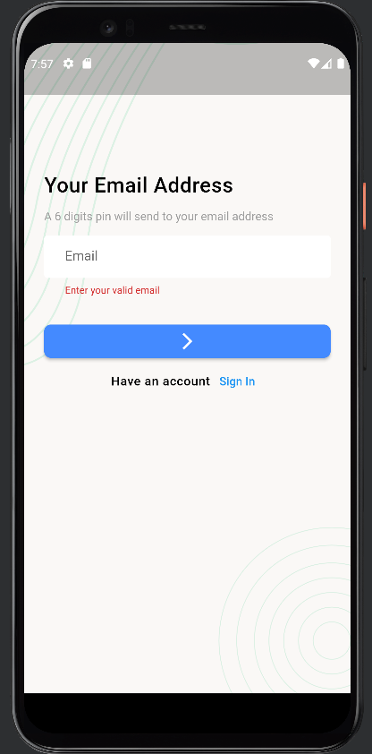

# if user not find

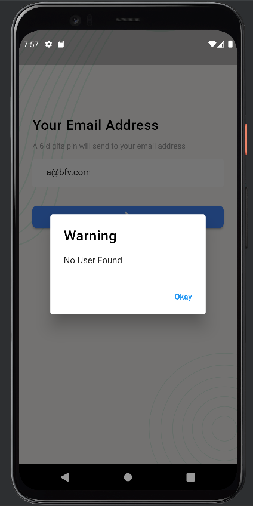

# otp verification

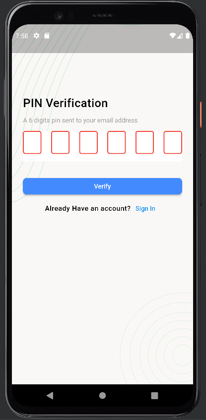

# if otp not matched

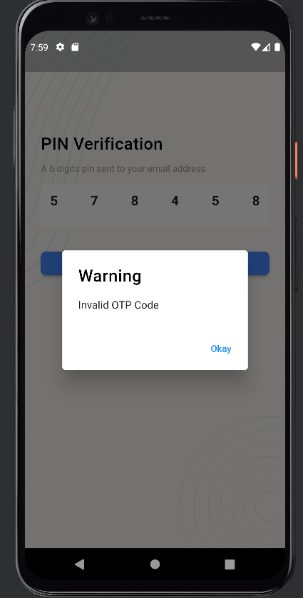

# otp send in email 

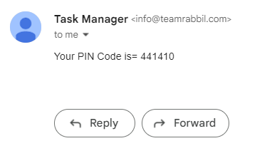

# correct otp enter

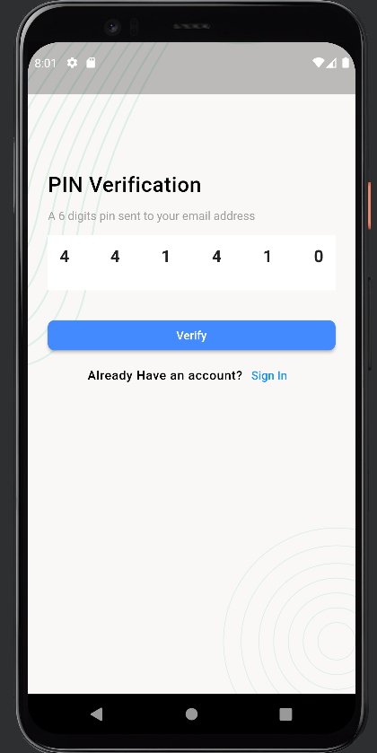

# password change

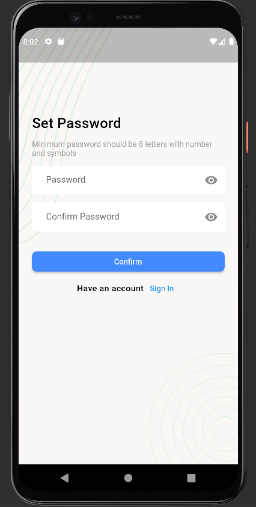

# on empty page

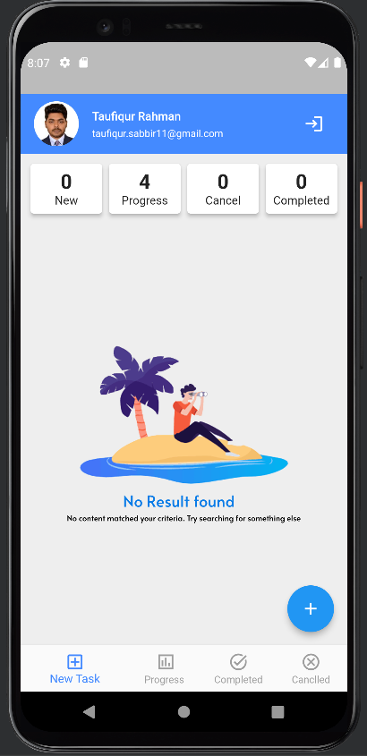

# new task section

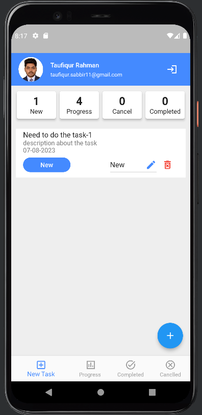
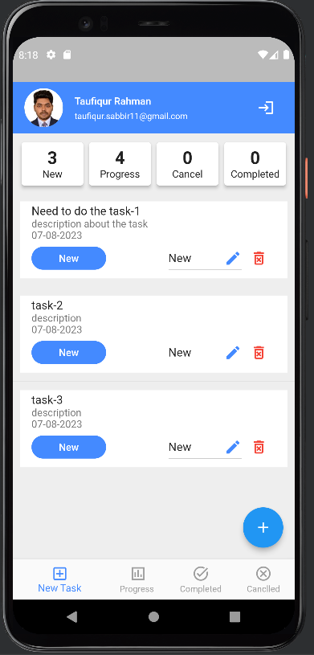

# add task 

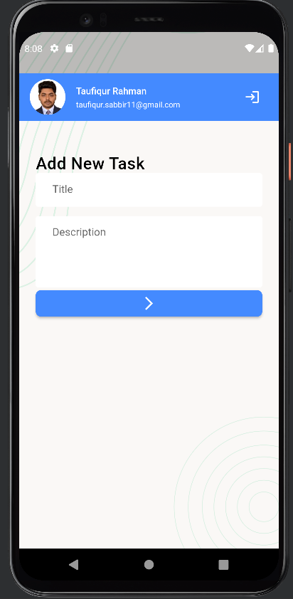

# change task status

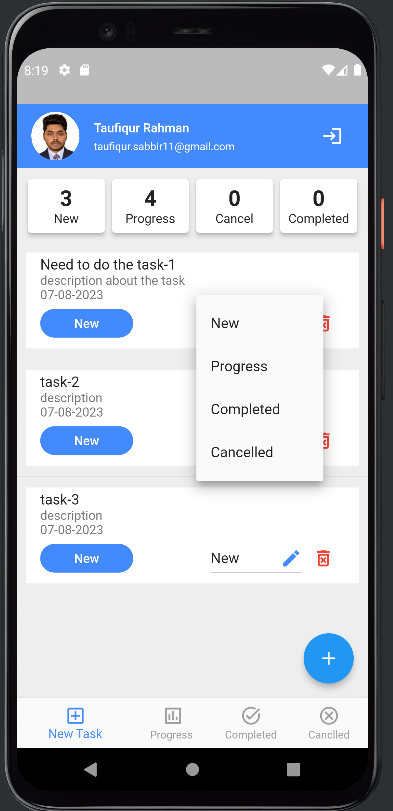

# progress task

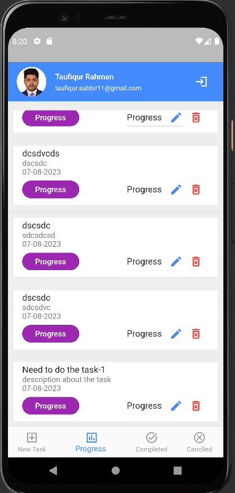

# completed

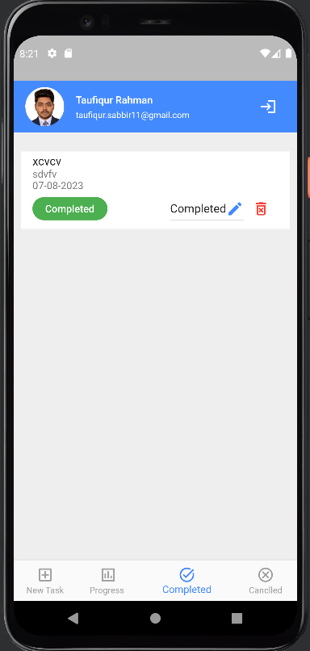

# canclled

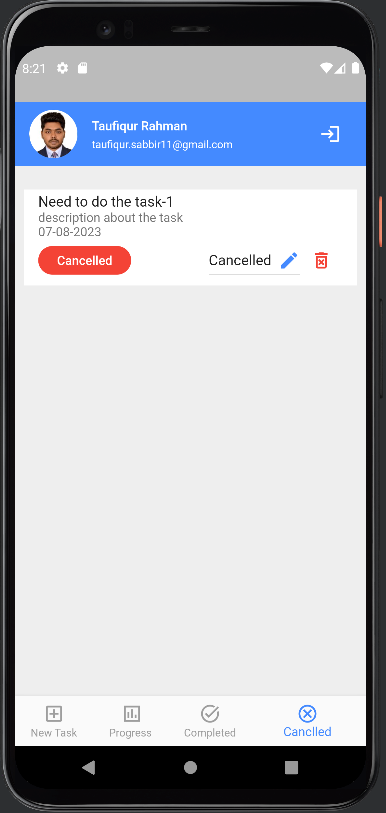

# delete task

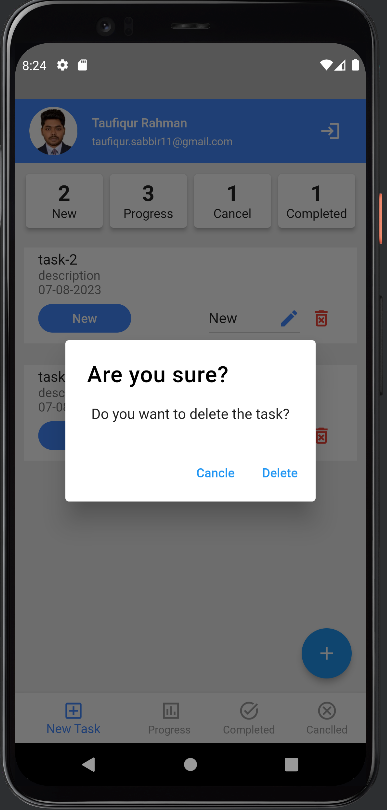

# profile update

